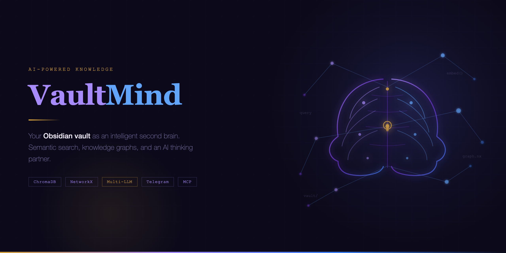

[](https://github.com/Mathews-Tom/VaultMind)

---

# VaultMind

AI-powered personal knowledge management built on Obsidian.

Turns your Obsidian vault into an intelligent second brain — semantic search,
knowledge graph, Telegram bot, AI thinking partner, and MCP integration for
connecting Claude and other agents directly to your notes.

## Why VaultMind?

- **Obsidian is the source of truth** — plain markdown files, always
- **AI augments, never replaces** — semantic search and knowledge graphs surface what you'd miss
- **Mobile-first capture** — Telegram bot gives full PKM access from your phone
- **Agent-native** — Claude Desktop/Code and other AI agents read/write your vault via MCP
- **Multi-provider LLM** — Anthropic, OpenAI, Gemini, or Ollama for thinking + extraction
- **Your data, your infra** — self-hosted, local-first, no cloud dependency

## Quick Start

### Prerequisites

- Python 3.12+
- [uv](https://docs.astral.sh/uv/) package manager
- One of: Anthropic / OpenAI / Gemini API key, or local Ollama
- OpenAI or Voyage API key (for embeddings)
- Telegram bot token (from [@BotFather](https://t.me/botfather))

### 1. Clone and install

```bash
git clone https://github.com/Mathews-Tom/vaultmind.git
cd vaultmind
uv sync --extra dev
```

This installs VaultMind into a local virtualenv. All commands run through `uv run`.

### 2. Configure secrets

```bash
cp .env.example .env
```

Edit `.env` with your API keys:

```bash
# LLM provider key (set the one matching your provider choice)
VAULTMIND_ANTHROPIC_API_KEY=sk-ant-...
# VAULTMIND_OPENAI_API_KEY=sk-...
# VAULTMIND_GEMINI_API_KEY=...

# Embedding key
VAULTMIND_OPENAI_API_KEY=sk-...

# Telegram bot
VAULTMIND_TELEGRAM__BOT_TOKEN=123456:ABC-DEF...
```

### 3. Configure settings

Edit `config/default.toml`:

```toml
[llm]
provider = "anthropic"        # "anthropic", "openai", "gemini", "ollama"
thinking_model = "claude-sonnet-4-20250514"

[vault]
path = "~/.vaultmind/vault"   # Or path to your existing Obsidian vault

[telegram]
allowed_user_ids = []          # Empty = allow all, or [123456789]
```

See [`config/default.toml`](config/default.toml) for all options.

### 4. Initialize

```bash
uv run vaultmind init
```

Creates the `~/.vaultmind/` directory structure:

```
~/.vaultmind/
├── vault/
│   ├── 00-inbox/
│   ├── 01-daily/
│   ├── 02-projects/
│   ├── 03-areas/
│   ├── 04-resources/
│   ├── 05-archive/
│   ├── 06-templates/
│   └── _meta/
└── data/
    ├── chromadb/
    └── knowledge_graph.json
```

### 5. Index your vault

```bash
uv run vaultmind index
```

Parses all markdown, chunks by headings, generates embeddings, stores in ChromaDB.

### 6. Build the knowledge graph

```bash
uv run vaultmind graph-build
```

Uses your configured LLM to extract entities and relationships from notes.
Add `--full` to rebuild from scratch.

### 7. Start the Telegram bot

```bash
uv run vaultmind bot
```

### 8. Other commands

```bash
uv run vaultmind graph-report   # Graph analytics report
uv run vaultmind stats          # Vault + graph statistics
uv run vaultmind mcp-serve      # MCP server for Claude Desktop/Code
```

## LLM Providers

Set `[llm].provider` in `config/default.toml` and the matching API key in `.env`.

| Provider  | Config                   | Model examples                                       |
| --------- | ------------------------ | ---------------------------------------------------- |
| Anthropic | `provider = "anthropic"` | `claude-sonnet-4-20250514`, `claude-opus-4-20250514` |
| OpenAI    | `provider = "openai"`    | `gpt-4.1`, `gpt-4.1-mini`                            |
| Gemini    | `provider = "gemini"`    | `gemini-2.5-flash`, `gemini-2.5-pro`                 |
| Ollama    | `provider = "ollama"`    | `llama3.3`, `qwen3`, `deepseek-r1`                   |

Ollama requires no API key. Set `ollama_base_url` if not running on `localhost:11434`.

## Telegram Bot

### Smart Message Routing

Plain text messages are classified automatically — no command prefix needed:

| You send                    | What happens                                     |
| --------------------------- | ------------------------------------------------ |
| `note: buy groceries`       | Captured to inbox (prefix stripped)              |
| `save: meeting notes...`    | Captured to inbox (prefix stripped)              |
| Multiline paste (3+ lines)  | Captured to inbox (pasted content = intentional) |
| Long text (500+ chars)      | Captured to inbox                                |
| "Hi", "thanks", "ok"        | Static greeting response (no LLM call)           |
| "What did I write about X?" | Vault-context-aware answer via LLM               |
| "Tell me about my projects" | Conversational response with vault context       |
| Follow-up after `/think`    | Continues thinking session (sticky)              |

Capture prefixes: `note:`, `save:`, `capture:`, `remember:`, `jot:`, `log:`

Set `capture_all = true` in `[routing]` config to restore old behavior (all text → capture).

### Commands

| Command                      | Description                                     |
| ---------------------------- | ----------------------------------------------- |
| `/recall <query>`            | Semantic search over vault                      |
| `/think <topic>`             | Start thinking partner session                  |
| `/think explore: <topic>`    | Divergent ideation mode                         |
| `/think critique: <topic>`   | Stress-test an idea                             |
| `/think synthesize: <topic>` | Connect dots across domains                     |
| `/think plan: <topic>`       | Create execution plan                           |
| `/graph <entity>`            | Query knowledge graph                           |
| `/daily`                     | Get/create today's daily note                   |
| `/review`                    | Weekly review with graph insights               |
| `/stats`                     | Vault and graph statistics                      |
| Send voice                   | Transcribe and capture (requires whisper extra) |

## MCP Integration

For Claude Desktop, add to `~/Library/Application Support/Claude/claude_desktop_config.json`:

```json
{
  "mcpServers": {
    "vaultmind": {
      "command": "uv",
      "args": [
        "run",
        "--directory",
        "/path/to/vaultmind",
        "vaultmind",
        "mcp-serve"
      ]
    }
  }
}
```

Install the MCP extra first:

```bash
uv sync --extra mcp
```

## Vault Structure

VaultMind expects (and creates via `init`) this structure:

```
~/.vaultmind/vault/
├── 00-inbox/          # Quick captures, unsorted
├── 01-daily/          # Daily notes
├── 02-projects/       # Active project notes
├── 03-areas/          # Life areas (health, finance, career)
├── 04-resources/      # Reference material, articles, book notes
├── 05-archive/        # Completed/inactive
├── 06-templates/      # Note templates
└── _meta/             # Auto-generated reports and indexes
```

Notes use YAML frontmatter:

```yaml
---
type: project # fleeting | literature | permanent | daily | project | person | concept
tags: [python, ai]
created: 2026-01-15
entities: [CAIRN, MCP]
status: active
---
```

## Configuration

Layered config system:

| Layer     | File                  | Purpose                                           |
| --------- | --------------------- | ------------------------------------------------- |
| Settings  | `config/default.toml` | All non-secret config (paths, models, thresholds) |
| Secrets   | `.env`                | API keys, bot token                               |
| Overrides | Environment variables | `VAULTMIND_*` prefix overrides any setting        |

Key config sections: `[vault]`, `[llm]`, `[telegram]`, `[routing]`, `[embedding]`, `[chroma]`, `[graph]`, `[mcp]`.
The `[routing]` section controls message routing behavior — `chat_model`, `chat_max_tokens`, `vault_context_enabled`, and the `capture_all` escape hatch.

## Docker

```bash
cp .env.example .env
# Edit .env with your API keys

cd docker
docker compose up -d vaultmind-bot
docker compose run --rm vaultmind-indexer
docker compose --profile mcp up -d   # Optional MCP server
```

## Development

```bash
uv sync --extra dev
uv run pytest -v
uv run mypy src/ --ignore-missing-imports
uv run ruff check src/ tests/
uv run ruff format src/ tests/
```

## Architecture

```text
┌──────────────────────────────────────────────────────┐
│                   User Interfaces                    │
│  Obsidian Desktop │ Obsidian Mobile │ Telegram │ MCP │
└────────┬──────────┴────────┬────────┴────┬─────┴──┬──┘
         │                   │             │        │
         ▼                   ▼             ▼        ▼
┌──────────────────────────────────────────────────────┐
│                    VaultMind Core                     │
│                                                      │
│  ┌──────────┐  ┌──────────────┐  ┌────────────────┐ │
│  │  Parser  │  │  Embedder +  │  │  Knowledge     │ │
│  │ (md+yaml)│  │  ChromaDB    │  │  Graph (nx)    │ │
│  └──────────┘  └──────────────┘  └────────────────┘ │
│                                                      │
│  ┌──────────────────────────────────────────────────┐│
│  │   LLM Abstraction (Anthropic/OpenAI/Gemini/     ││
│  │   Ollama) → Thinking Partner + Entity Extraction ││
│  └──────────────────────────────────────────────────┘│
└──────────────────────────────────────────────────────┘
         │
         ▼
   ~/.vaultmind/
   ├── vault/     (Obsidian markdown files)
   └── data/      (ChromaDB + knowledge graph)
```

## Tech Stack

| Layer           | Technology                                            |
| --------------- | ----------------------------------------------------- |
| Language        | Python 3.12+                                          |
| LLM             | Anthropic, OpenAI, Gemini, Ollama (provider-agnostic) |
| Embeddings      | OpenAI / Voyage                                       |
| Vector Store    | ChromaDB                                              |
| Knowledge Graph | NetworkX                                              |
| Telegram Bot    | aiogram 3.x                                           |
| Agent Protocol  | MCP                                                   |
| CLI             | Click + Rich                                          |
| Config          | Pydantic Settings + TOML                              |
| Packaging       | Hatch + uv                                            |

## License

MIT — see [LICENSE](LICENSE).
</content>
</invoke>
