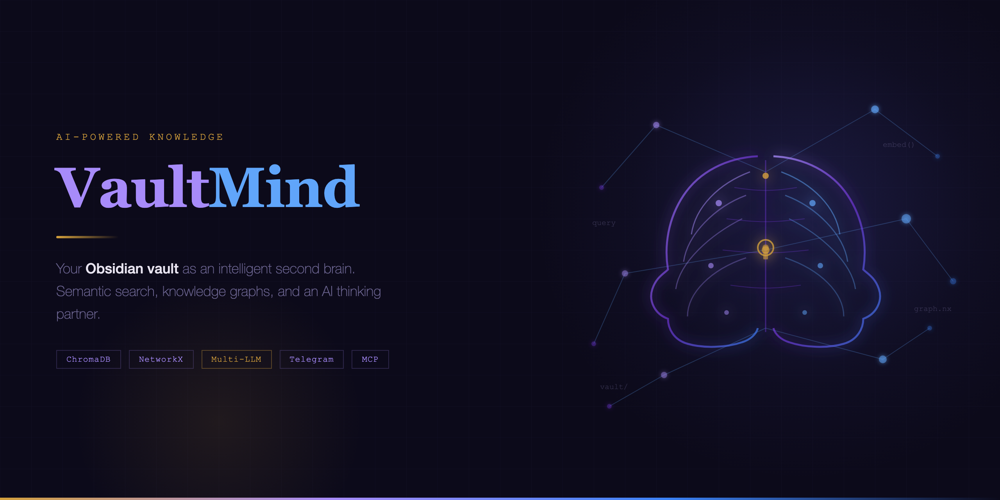

[](https://github.com/Mathews-Tom/VaultMind)

---

# VaultMind

AI-powered personal knowledge management built on Obsidian.

Turns your Obsidian vault into an intelligent second brain — hybrid search
(vector + BM25), knowledge graph, Telegram bot with photo capture, AI thinking
partner, Zettelkasten maturation pipeline, belief evolution tracking, episodic
and procedural memory, and MCP integration for connecting Claude and other
agents directly to your notes.

## Why VaultMind?

- **Obsidian is the source of truth** — plain markdown files, always
- **AI augments, never replaces** — hybrid search (vector + BM25) and knowledge graphs surface what you'd miss
- **Mobile-first capture** — Telegram bot gives full PKM access from your phone, including photo capture via vision models
- **Agent-native** — Claude Desktop/Code and other AI agents read/write your vault via MCP
- **Multi-provider LLM** — Anthropic, OpenAI, Gemini, or Ollama for thinking + extraction
- **Hybrid retrieval** — Reciprocal Rank Fusion merges vector (ChromaDB) and keyword (SQLite FTS5) search results
- **Contextual embeddings** — chunks carry document-level context (title, type, section, tags) for higher-quality vectors
- **Zettelkasten maturation** — DBSCAN clustering surfaces fleeting notes ready for permanent synthesis
- **Belief evolution** — tracks confidence drift, relationship shifts, and stale claims across your knowledge
- **Episodic memory** — decision-outcome tracking with lessons learned and entity linking
- **Procedural memory** — mines recurring decision patterns into reusable workflows (experimental)
- **Note modes** — learning vs. operational mode with activation-based decay scoring
- **Secure by default** — path traversal protection, input sanitization, injection detection on all vault operations
- **Smart caching** — SQLite-backed embedding cache eliminates redundant API calls during re-indexing
- **Your data, your infra** — self-hosted, local-first, no cloud dependency

## Quick Start

### Prerequisites

- Python 3.12+
- [uv](https://docs.astral.sh/uv/) package manager
- One of: Anthropic / OpenAI / Gemini API key, or local Ollama
- OpenAI or Voyage API key (for embeddings)
- Telegram bot token (from [@BotFather](https://t.me/botfather))

### 1. Clone and install

```bash
git clone https://github.com/Mathews-Tom/vaultmind.git
cd vaultmind
uv sync --extra dev
```

This installs VaultMind into a local virtualenv. All commands run through `uv run`.

### 2. Configure secrets

```bash
cp .env.example .env
```

Edit `.env` with your API keys:

```bash
# LLM provider key (set the one matching your provider choice)
VAULTMIND_ANTHROPIC_API_KEY=sk-ant-...
# VAULTMIND_OPENAI_API_KEY=sk-...
# VAULTMIND_GEMINI_API_KEY=...

# Embedding key (required for default OpenAI embeddings)
VAULTMIND_OPENAI_API_KEY=sk-...
# VAULTMIND_VOYAGE_API_KEY=pa-...   # If using Voyage embeddings

# Telegram bot
VAULTMIND_TELEGRAM__BOT_TOKEN=123456:ABC-DEF...
VAULTMIND_TELEGRAM__ALLOWED_USER_IDS=[123456789]  # Optional whitelist
```

### 3. Configure settings

Edit `config/default.toml`:

```toml
[llm]
provider = "anthropic"        # "anthropic", "openai", "gemini", "ollama"
thinking_model = "claude-sonnet-4-20250514"

[vault]
path = "~/.vaultmind/vault"   # Or path to your existing Obsidian vault

[telegram]
thinking_session_ttl = 3600
```

See [`config/default.toml`](config/default.toml) for all options.

### 4. Initialize

```bash
uv run vaultmind init
```

Creates the `~/.vaultmind/` directory structure:

```text
~/.vaultmind/
├── vault/
│   ├── 00-inbox/
│   ├── 01-daily/
│   ├── 02-projects/
│   ├── 03-areas/
│   ├── 04-resources/
│   ├── 05-archive/
│   ├── 06-templates/
│   └── _meta/
└── data/
    ├── chromadb/
    ├── bm25.db
    ├── embedding_cache.db
    ├── knowledge_graph.json
    ├── activations.db
    ├── episodes.db
    ├── preferences.db
    └── sessions.db
```

### 5. Index your vault

```bash
uv run vaultmind index
```

Parses all markdown, chunks by headings, generates embeddings, stores in ChromaDB.

### 6. Build the knowledge graph

```bash
uv run vaultmind graph-build
```

Uses your configured LLM to extract entities and relationships from notes.
Add `--full` to rebuild from scratch.

### 7. Start the Telegram bot

```bash
uv run vaultmind bot
```

The bot starts with watch mode enabled — vault changes are indexed incrementally.

## CLI Commands

| Command                              | Description                                                             |
| ------------------------------------ | ----------------------------------------------------------------------- |
| `vaultmind init`                     | Create vault folder structure                                           |
| `vaultmind index`                    | Full vault index into ChromaDB                                          |
| `vaultmind watch`                    | Watch vault, incrementally re-index on change                           |
| `vaultmind watch --graph`            | Watch + batched graph re-extraction                                     |
| `vaultmind bot`                      | Start Telegram bot (includes watch + duplicate detection + suggestions) |
| `vaultmind graph-build`              | Build knowledge graph (add `--full` to rebuild)                         |
| `vaultmind graph-maintain`           | Prune stale refs + remove orphan entities                               |
| `vaultmind graph-report`             | Generate graph analytics report                                         |
| `vaultmind scan-duplicates`          | Scan vault for duplicate/merge candidates                               |
| `vaultmind suggest-links`            | Suggest links between notes                                             |
| `vaultmind digest`                   | Generate weekly digest (add `--save` to write to vault)                 |
| `vaultmind auto-tag`                 | LLM-based tag suggestions (dry-run by default)                          |
| `vaultmind auto-tag --apply`         | Apply suggested tags to frontmatter                                     |
| `vaultmind research "query"`         | Search YouTube, analyze transcripts, create vault notes                 |
| `vaultmind learn`                    | Analyze usage patterns, generate insights report                        |
| `vaultmind learn --save`             | Save insights report to vault                                           |
| `vaultmind tag-synonyms`             | Detect likely tag synonyms and suggest merges                           |
| `vaultmind synthesize-workflows`     | Mine episodic memory for workflow patterns                              |
| `vaultmind stats`                    | Show vault + graph statistics                                           |
| `vaultmind stats --metadata-audit`   | Audit frontmatter completeness                                          |
| `vaultmind mcp-serve`                | Start MCP server (default profile: researcher)                          |
| `vaultmind mcp-serve --profile full` | Start MCP with full access                                              |

## LLM Providers

Set `[llm].provider` in `config/default.toml` and the matching API key in `.env`.

| Provider  | Config                   | Model examples                                       |
| --------- | ------------------------ | ---------------------------------------------------- |
| Anthropic | `provider = "anthropic"` | `claude-sonnet-4-20250514`, `claude-opus-4-20250514` |
| OpenAI    | `provider = "openai"`    | `gpt-4.1`, `gpt-4.1-mini`                            |
| Gemini    | `provider = "gemini"`    | `gemini-2.5-flash`, `gemini-2.5-pro`                 |
| Ollama    | `provider = "ollama"`    | `llama3.3`, `qwen3`, `deepseek-r1`                   |

Ollama requires no API key. Set `ollama_base_url` if not running on `localhost:11434`.

## Telegram Bot

### Smart Message Routing

Plain text messages are classified automatically — no command prefix needed:

| You send                    | What happens                                               |
| --------------------------- | ---------------------------------------------------------- |
| `note: buy groceries`       | Captured to inbox (prefix stripped)                        |
| `save: meeting notes...`    | Captured to inbox (prefix stripped)                        |
| Multiline paste (3+ lines)  | Captured to inbox (pasted content = intentional)           |
| Long text (500+ chars)      | Captured to inbox                                          |
| "Hi", "thanks", "ok"        | Static greeting response (no LLM call)                     |
| "What did I write about X?" | Vault-context-aware answer via LLM                         |
| "Tell me about my projects" | Conversational response with vault context                 |
| Follow-up after `/think`    | Continues thinking session (sticky)                        |
| URL in message              | Auto-ingests YouTube transcript or article content         |
| Photo/image                 | Described via vision model, saved as note with image embed |

Capture prefixes: `note:`, `save:`, `capture:`, `remember:`, `jot:`, `log:`

Set `capture_all = true` in `[routing]` config to restore old behavior (all text → capture).

### Commands

| Command                         | Description                                                     |
| ------------------------------- | --------------------------------------------------------------- |
| `/recall <query>`               | Semantic search over vault (paginated)                          |
| `/think <topic>`                | Start thinking partner session (persists across restarts)       |
| `/think explore: <topic>`       | Divergent ideation mode                                         |
| `/think critique: <topic>`      | Stress-test an idea                                             |
| `/think synthesize: <topic>`    | Connect dots across domains                                     |
| `/think plan: <topic>`          | Create execution plan                                           |
| `/graph <entity>`               | Query knowledge graph connections                               |
| `/daily`                        | Get/create today's daily note                                   |
| `/notes <date>`                 | Find notes by date (natural language: `yesterday`, `last week`) |
| `/read <note>`                  | Read full note content                                          |
| `/edit <note> <instruction>`    | AI-assisted edit with confirmation                              |
| `/delete <note>`                | Delete note with confirmation                                   |
| `/bookmark <title>`             | Save thinking session or last Q&A to vault                      |
| `/suggest <note>`               | Find notes worth linking (composite scoring)                    |
| `/duplicates <note>`            | Find duplicate/similar notes                                    |
| `/review`                       | Weekly review with graph insights                               |
| `/evolve`                       | Belief evolution signals (confidence drift, stale claims)       |
| `/mature`                       | Zettelkasten maturation — clusters ready for synthesis          |
| `/decide <decision>`            | Record a decision (creates pending episode)                     |
| `/outcome <id> <status> <desc>` | Resolve a decision with outcome and lessons                     |
| `/episodes [entity]`            | List episodes, optionally filtered by entity                    |
| `/workflows`                    | List active workflow patterns with success rates                |
| `/workflow <id>`                | Show workflow steps and details                                 |
| `/health`                       | System health check                                             |
| `/stats`                        | Vault and graph statistics                                      |
| Send voice message              | Transcribe via Whisper and route as capture or question         |
| Send photo                      | Describe via vision model and capture as note with image embed  |

## MCP Integration

For Claude Desktop, add to `~/Library/Application Support/Claude/claude_desktop_config.json`:

```json
{
  "mcpServers": {
    "vaultmind": {
      "command": "uv",
      "args": [
        "run",
        "--directory",
        "/path/to/vaultmind",
        "vaultmind",
        "mcp-serve"
      ]
    }
  }
}
```

Install the MCP extra first:

```bash
uv sync --extra mcp
```

### MCP Tools

| Tool              | Description                                                      |
| ----------------- | ---------------------------------------------------------------- |
| `vault_search`    | Semantic search with optional note type filter                   |
| `vault_read`      | Read full note by relative path                                  |
| `vault_write`     | Create/overwrite note + auto-reindex                             |
| `vault_list`      | List folder contents with optional tag/type filter               |
| `graph_query`     | Entity neighbors and relationships (configurable depth)          |
| `graph_path`      | Shortest path between two entities                               |
| `find_duplicates` | Semantic duplicate detection (duplicate/merge bands)             |
| `suggest_links`   | Note suggestions (similarity + shared entities + graph distance) |
| `capture`         | Quick-capture to inbox with optional title and tags              |
| `capture_note`    | Rich capture with note type, tags, and target folder             |

### MCP Profiles

Profiles control per-agent access. Activate with `--profile <name>`:

| Profile                | Access                                           | Folders                   |
| ---------------------- | ------------------------------------------------ | ------------------------- |
| `researcher` (default) | Read-only: search, read, list, graph             | All                       |
| `planner`              | Read/write: + capture, capture_note, vault_write | `02-projects`, `00-inbox` |
| `full`                 | Unrestricted (requires explicit opt-in)          | All                       |

## Vault Structure

VaultMind expects (and creates via `init`) this structure:

```text
~/.vaultmind/vault/
├── 00-inbox/          # Quick captures, unsorted
├── 01-daily/          # Daily notes
├── 02-projects/       # Active project notes
├── 03-areas/          # Life areas (health, finance, career)
├── 04-resources/      # Reference material, articles, book notes
├── 05-archive/        # Completed/inactive
├── 06-templates/      # Note templates
└── _meta/             # Auto-generated reports and indexes
```

Notes use YAML frontmatter:

```yaml
---
type: project # fleeting | literature | permanent | daily | project | area | person | concept
mode: operational # learning (default) | operational — affects retrieval ranking
tags: [python, ai]
created: 2026-01-15
entities: [CAIRN, MCP]
status: active
---
```

## Configuration

Layered config system:

| Layer     | File                  | Purpose                                           |
| --------- | --------------------- | ------------------------------------------------- |
| Settings  | `config/default.toml` | All non-secret config (paths, models, thresholds) |
| Secrets   | `.env`                | API keys, bot token                               |
| Overrides | Environment variables | `VAULTMIND_*` prefix overrides any setting        |

Config sections: `[vault]`, `[llm]`, `[telegram]`, `[routing]`, `[embedding]`, `[chroma]`, `[graph]`, `[watch]`, `[duplicate_detection]`, `[note_suggestions]`, `[search]`, `[ranking]`, `[activation]`, `[maturation]`, `[evolution]`, `[digest]`, `[auto_tag]`, `[voice]`, `[ingest]`, `[research]`, `[tracking]`, `[image]`, `[episodic]`, `[procedural]`, `[mcp]`.

See [Configuration Reference](docs/configuration.md) for details on every section.

## Docker

```bash
cp .env.example .env
# Edit .env with your API keys

cd docker
docker compose up -d vaultmind-bot
docker compose --profile indexer run --rm vaultmind-indexer
docker compose --profile mcp up -d   # Optional MCP server on port 8765
```

## Development

```bash
uv sync --extra dev
uv run pytest -v
uv run mypy src/ --ignore-missing-imports
uv run ruff check src/ tests/
uv run ruff format src/ tests/
```

## Architecture

```text
┌───────────────────────────────────────────────────────────────┐
│                       User Interfaces                         │
│  Obsidian Desktop │ Obsidian Mobile │ Telegram Bot │ MCP      │
└────────┬──────────┴────────┬────────┴──────┬───────┴──┬───────┘
         │                   │               │          │
         ▼                   ▼               ▼          ▼
┌───────────────────────────────────────────────────────────────┐
│                        VaultMind Core                         │
│                                                               │
│  ┌──────────────┐  ┌──────────────────┐  ┌─────────────────┐  │
│  │ Parser       │  │ Hybrid Search    │  │ Knowledge Graph │  │
│  │ (contextual  │  │ (ChromaDB +      │  │ (nx) + Belief   │  │
│  │  chunks)     │  │  BM25 FTS5 + RRF)│  │   Evolution     │  │
│  └──────────────┘  └──────────────────┘  └─────────────────┘  │
│                                                               │
│  ┌──────────────────────┐  ┌──────────────────────────────┐   │
│  │ LLM Abstraction      │  │ Maturation Pipeline          │   │
│  │ (Anthropic/OpenAI/   │  │ (DBSCAN clustering →         │   │
│  │  Gemini/Ollama)      │  │  LLM synthesis)              │   │
│  │ + Multimodal (vision)│  └──────────────────────────────┘   │
│  └──────────────────────┘                                     │
│                                                               │
│  ┌──────────────────────┐  ┌──────────────────────────────┐   │
│  │ Memory System        │  │ Research Pipeline            │   │
│  │ (Episodic: decisions │  │ (YouTube → vault)            │   │
│  │  + Procedural:       │  ├──────────────────────────────┤   │
│  │    workflows)        │  │ Preference Tracking          │   │
│  └──────────────────────┘  │ + Activation Scoring         │   │
│                            └──────────────────────────────┘   │
└───────────────────────────────────────────────────────────────┘
         │
         ▼
   ~/.vaultmind/
   ├── vault/     (Obsidian markdown files)
   └── data/      (ChromaDB + BM25 + graph + episodes + activations + sessions)
```

## Tech Stack

| Layer           | Technology                                            |
| --------------- | ----------------------------------------------------- |
| Language        | Python 3.12+                                          |
| LLM             | Anthropic, OpenAI, Gemini, Ollama (provider-agnostic) |
| Embeddings      | OpenAI / Voyage                                       |
| Vector Store    | ChromaDB                                              |
| Knowledge Graph | NetworkX                                              |
| Clustering      | scikit-learn (DBSCAN)                                 |
| Telegram Bot    | aiogram 3.x                                           |
| Agent Protocol  | MCP                                                   |
| CLI             | Click + Rich                                          |
| Config          | Pydantic Settings + TOML                              |
| Packaging       | Hatch + uv                                            |

## Documentation

- [Configuration Reference](docs/configuration.md)
- [Architecture Guide](docs/architecture.md)
- [Telegram Bot Guide](docs/telegram-bot.md)
- [MCP Integration Guide](docs/mcp-integration.md)
- [Knowledge Graph](docs/knowledge-graph.md)
- [Zettelkasten Maturation](docs/zettelkasten-maturation.md)

## License

MIT — see [LICENSE](LICENSE).
