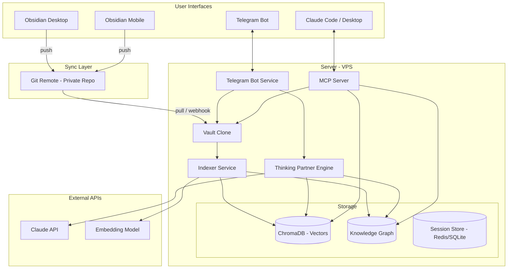
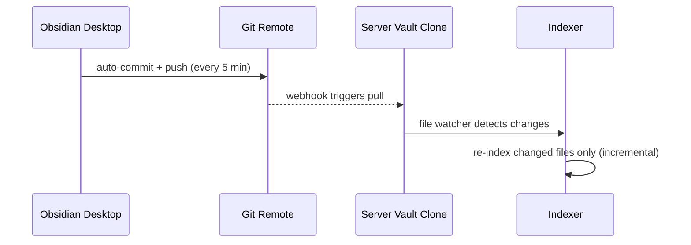
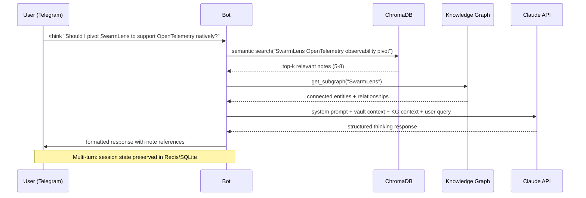
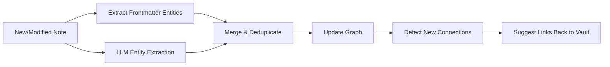

# Obsidian-Centric PKM: Architecture Design

## 1. Design Philosophy

Build a **personal knowledge operating system** around Obsidian as the source of truth, with satellite services for mobile access (Telegram), semantic retrieval (RAG), structured reasoning (knowledge graphs), and AI-powered ideation (Claude as thinking partner). Every component reads/writes plain markdown — no vendor lock-in, no proprietary formats.

### Core Principles

| Principle | Implication |
|---|---|
| Obsidian is the canonical store | All other systems are indexes or interfaces into the vault |
| Markdown-native | Every note is a `.md` file; metadata lives in YAML frontmatter |
| Local-first, sync-second | Vault lives on disk; sync is a transport layer, not a dependency |
| Agents are readers/writers | Claude, Telegram bot, and future agents interact via the same vault API |
| Knowledge graph is emergent | Graph structure is extracted from notes, not imposed top-down |

---

## 2. Requirements Matrix

| Requirement | Solution Layer | Tool/Tech |
|---|---|---|
| PKM core (notes, links, tags) | Obsidian Desktop + Mobile | Obsidian |
| Full mobile access | Telegram Bot | `aiogram` + self-hosted bot |
| Extended memory (life logging) | Quick capture + periodic review templates | Telegram → vault pipeline |
| Claude / agent connectivity | MCP Server + REST API | Custom MCP server over vault |
| Knowledge graphs | Entity extraction + graph DB | `NetworkX` (lightweight) or Neo4j (if scaling) |
| Thinking partner | RAG-augmented LLM conversation | Claude API + vector search |
| Cross-device sync | Git-based sync | `obsidian-git` plugin + private repo |

---

## 3. Architecture Overview



---

## 4. Component Deep Dive

### 4.1 Obsidian Vault Structure

```
vault/
├── 00-inbox/              # Quick captures, unsorted
├── 01-daily/              # Daily notes (journal, logs)
├── 02-projects/           # Active project notes
├── 03-areas/              # Life areas (health, finance, career, relationships)
├── 04-resources/          # Reference material, articles, book notes
├── 05-archive/            # Completed/inactive
├── 06-templates/          # Note templates
├── _meta/
│   ├── graph-exports/     # Periodic KG snapshots
│   └── indexes/           # Auto-generated index notes
└── .obsidian/             # Config, plugins, themes
```

**Frontmatter Convention** (critical for downstream indexing):

```yaml
---
type: fleeting | literature | permanent | daily | project | person | concept
tags: [tag1, tag2]
created: 2026-02-24
modified: 2026-02-24
related: [[Note A]], [[Note B]]
entities: [entity1, entity2]  # For KG extraction
status: active | review | archived
source: telegram | manual | agent
---
```

**Essential Obsidian Plugins:**

| Plugin | Purpose |
|---|---|
| `obsidian-git` | Auto-commit + push/pull on interval |
| `dataview` | Query notes as a database |
| `templater` | Dynamic templates for daily notes, captures |
| `periodic-notes` | Daily/weekly/monthly review structure |
| `local-rest-api` | HTTP API for external tool access (alternative to MCP) |
| `excalidraw` | Visual thinking, diagrams within vault |
| `kanban` | Project/task management boards |
| `graph-analysis` | Enhanced graph metrics (betweenness, clusters) |

### 4.2 Sync Layer

**Git-based sync** is the right call for your setup — free, transparent, works with any server.



**Implementation detail:** Use a GitHub/Gitea webhook to trigger a `git pull` on the VPS. A file watcher (`watchdog` in Python) detects changed `.md` files and queues them for re-indexing. This gives you near-real-time sync with minimal overhead.

**Conflict resolution:** `obsidian-git` handles merge conflicts via last-write-wins on non-conflicting changes. For actual conflicts (rare in single-user), it creates `.conflict` files for manual resolution.

### 4.3 Telegram Bot

This is your primary mobile interface. Design it as a full PKM client, not just a capture tool.

**Tech stack:** `aiogram 3.x` (async, modern, well-maintained) + `Claude API` + `ChromaDB client`

**Command Interface:**

| Command | Function | Example |
|---|---|---|
| `/capture <text>` or just send text | Quick note to inbox | "Meeting with Raj about SahAI demo at 3pm" |
| `/think <topic>` | Start thinking partner session | `/think architecture for drift detection in Pramana` |
| `/recall <query>` | Semantic search over vault | `/recall what did I decide about CAIRN's context layer?` |
| `/graph <entity>` | Show entity connections | `/graph CAIRN` → returns connected concepts, notes |
| `/daily` | Get/create today's daily note | Returns summary + open items |
| `/review` | Weekly review prompts | Guided reflection questions with context |
| `/link <note> <note>` | Create bidirectional link | `/link CAIRN "context-aware retrieval"` |
| `/tag <query>` | Browse by tag | `/tag #project` |
| voice message | Transcribe → capture | Whisper API → structured note |

**Thinking Partner Mode (`/think`):**

This is the high-value feature. It's not just chat — it's RAG-augmented ideation with your full knowledge base as context.



**System prompt for thinking partner mode:**

```
You are a thinking partner with access to the user's personal knowledge base.
You have context from their notes and knowledge graph.

Your job is to:
1. Challenge assumptions with evidence from their own notes
2. Surface connections they might have missed
3. Play devil's advocate when appropriate
4. Synthesize across different knowledge domains in their vault
5. End with concrete next actions or open questions

Reference specific notes when relevant: [[Note Name]]
```

### 4.4 RAG / Semantic Search Layer

**Embedding pipeline:**

```
Vault .md files
    → chunk (by heading sections, ~500 tokens each)
    → extract metadata (frontmatter, links, tags)
    → embed (voyage-3-lite or text-embedding-3-small)
    → store in ChromaDB with metadata filters
```

**Chunking strategy:** Don't chunk arbitrarily by token count. Use heading-aware chunking — each `## Section` becomes a chunk, preserving semantic coherence. For notes without headings, fall back to paragraph-level splits.

**ChromaDB collection schema:**

```python
collection.add(
    ids=[f"{note_path}::{chunk_idx}"],
    documents=[chunk_text],
    metadatas=[{
        "note_path": "02-projects/cairn/architecture.md",
        "note_title": "CAIRN Architecture",
        "type": "permanent",
        "tags": ["cairn", "architecture", "mcp"],
        "entities": ["CAIRN", "MCP", "context-layer"],
        "created": "2026-01-15",
        "modified": "2026-02-20",
        "heading": "## Three-Layer Hybrid Design",
        "chunk_idx": 2
    }],
    embeddings=[embedding_vector]
)
```

**Query-time filtering:** ChromaDB's `where` clause lets you scope searches by type, tag, date range, or entity — critical for avoiding noise in a large vault.

### 4.5 Knowledge Graph

This is where your PKM transcends basic note-taking. The graph captures **entities and their relationships** extracted from notes, giving you a queryable semantic network.

**Two-layer approach:**

1. **Obsidian's built-in graph** — for visual exploration on desktop
2. **Programmatic graph (NetworkX → persisted as JSON)** — for Telegram queries, agent access, and automated analysis

**Entity extraction pipeline:**



**Graph schema:**

```python
# Node types
NODE_TYPES = ["person", "project", "concept", "tool", "organization", "event", "location"]

# Edge types (relationships)
EDGE_TYPES = [
    "related_to",       # generic
    "part_of",          # component → system
    "depends_on",       # project → tool
    "created_by",       # artifact → person
    "influences",       # concept → concept
    "mentioned_in",     # entity → note (provenance)
    "competes_with",    # project → project
    "preceded_by",      # temporal ordering
]
```

**Why NetworkX over Neo4j for v1:** You're a solo user. NetworkX + JSON persistence gives you zero-infra graph operations, in-process queries, and trivial backup (it's just a file in the vault). If you hit scale limits or need multi-hop Cypher queries, Neo4j Community Edition is the upgrade path.

**Automated graph enrichment:** Run a nightly job that:
1. Scans all notes modified in the last 24h
2. Extracts entities via Claude (structured output)
3. Updates the graph
4. Identifies **orphan entities** (mentioned but never linked) and **bridge entities** (high betweenness centrality connecting otherwise disconnected clusters)
5. Writes a `_meta/graph-report.md` note with suggestions

### 4.6 MCP Server (Agent Integration)

Expose vault operations as an MCP server so Claude Desktop, Claude Code, or any MCP-compatible agent can interact with your PKM.

**MCP Tools to expose:**

| Tool | Description |
|---|---|
| `vault_search` | Semantic search over vault via ChromaDB |
| `vault_read` | Read a specific note by path |
| `vault_write` | Create or update a note |
| `vault_list` | List notes by folder, tag, or type |
| `graph_query` | Query knowledge graph (neighbors, paths, clusters) |
| `graph_entity` | Get all info about a specific entity |
| `daily_summary` | Get today's daily note + open tasks |
| `capture` | Quick-capture a note to inbox |

This means when you're working in Claude Code on a project, you can say "check my notes on CAIRN's architecture" and Claude will pull the relevant context directly from your vault.

---

## 5. Accelerator: Khoj as a Starting Point

Before building everything custom, evaluate **[Khoj](https://khoj.dev)** — an open-source AI personal assistant that already solves 60-70% of this:

| Feature | Khoj Coverage | Custom Extension Needed |
|---|---|---|
| Obsidian plugin + sync | ✅ Native | — |
| Telegram bot | ✅ Built-in | Customize commands |
| RAG over notes | ✅ Core feature | Tune chunking + embeddings |
| Claude API support | ✅ Supported | — |
| Web UI | ✅ Built-in | — |
| Knowledge graph | ❌ Not native | Full custom build |
| MCP server | ❌ Not native | Full custom build |
| Thinking partner mode | ⚠️ Partial (chat) | Custom system prompts + session mgmt |
| Voice capture | ⚠️ Partial | Whisper integration |

**Recommended approach:** Deploy Khoj for the Obsidian sync + Telegram + RAG baseline, then build the knowledge graph and MCP layers as custom extensions that plug into the same vault.

```
Khoj (handles: sync, RAG, Telegram, web UI)
  +
Custom KG Service (handles: entity extraction, graph queries)
  +
Custom MCP Server (handles: agent integration)
```

This gets you to a usable system in days rather than weeks, with a clear extension path.

---

## 6. Implementation Roadmap

### Phase 1: Foundation (Week 1)

- [ ] Set up Obsidian vault with folder structure + frontmatter conventions
- [ ] Install and configure essential plugins (`obsidian-git`, `dataview`, `templater`, `periodic-notes`)
- [ ] Create templates: daily note, capture, project, person, concept
- [ ] Set up private Git repo + auto-sync (5-min interval)
- [ ] Provision VPS (even a small Hetzner/DigitalOcean box works)
- [ ] Deploy Khoj (Docker) connected to vault clone

**Deliverable:** Working Obsidian vault that syncs to server, basic AI chat via Khoj

### Phase 2: Telegram Interface (Week 2)

- [ ] Configure Khoj's Telegram bot OR build custom bot with `aiogram`
- [ ] Implement quick capture: text → inbox note with frontmatter
- [ ] Implement `/recall` semantic search
- [ ] Implement `/daily` command
- [ ] Add voice message → Whisper → structured capture
- [ ] Test end-to-end: capture on phone → appears in Obsidian desktop

**Deliverable:** Full mobile PKM access via Telegram

### Phase 3: Knowledge Graph (Week 3)

- [ ] Build entity extraction pipeline (Claude structured output)
- [ ] Implement NetworkX graph with JSON persistence
- [ ] Create initial graph from existing vault notes
- [ ] Add `/graph` command to Telegram bot
- [ ] Build nightly enrichment job (orphan detection, bridge entities)
- [ ] Write graph insights back to `_meta/graph-report.md`

**Deliverable:** Queryable knowledge graph with automated maintenance

### Phase 4: Thinking Partner (Week 4)

- [ ] Build `/think` command with multi-turn session state
- [ ] Implement RAG + KG context retrieval for thinking sessions
- [ ] Design system prompts for different thinking modes:
  - `explore`: divergent ideation
  - `critique`: stress-test an idea
  - `synthesize`: connect dots across domains
  - `plan`: break down into actionable steps
- [ ] Add session persistence so you can `/think continue` later
- [ ] Implement automatic note creation from thinking session conclusions

**Deliverable:** AI thinking partner grounded in your personal knowledge

### Phase 5: Agent Integration (Week 5)

- [ ] Build MCP server exposing vault operations
- [ ] Test with Claude Desktop / Claude Code
- [ ] Add graph query tools to MCP
- [ ] Create `.claude/settings.json` pointing to PKM MCP server

**Deliverable:** Claude agents can read/write your PKM natively

### Phase 6: Refinement (Ongoing)

- [ ] Tune embedding model and chunking strategy based on retrieval quality
- [ ] Add periodic review workflows (weekly, monthly, quarterly)
- [ ] Build dashboards: vault growth, graph density, orphan notes
- [ ] Experiment with automated note suggestions (based on KG analysis)
- [ ] Add cross-reference detection (find notes that should be linked but aren't)

---

## 7. Tech Stack Summary

| Layer | Technology | Why |
|---|---|---|
| PKM Core | Obsidian | Best-in-class markdown PKM, massive ecosystem |
| Sync | Git (`obsidian-git`) | Free, transparent, developer-native |
| Server | Ubuntu VPS (Hetzner/DO) | Cheap, reliable, full control |
| Telegram Bot | `aiogram 3.x` (or Khoj built-in) | Async, modern, well-maintained |
| Vector Store | ChromaDB | Lightweight, embedded, good enough for personal scale |
| Knowledge Graph | NetworkX + JSON | Zero-infra, in-process, upgradable to Neo4j |
| LLM | Claude API (Sonnet for fast, Opus for deep) | Best reasoning for thinking partner mode |
| Embeddings | `text-embedding-3-small` or `voyage-3-lite` | Good quality/cost ratio |
| Transcription | Whisper (local or API) | Voice → text for mobile capture |
| Agent Integration | Custom MCP Server | Native Claude tool access |
| Container | Docker Compose | Single `docker-compose up` for entire server stack |

---

## 8. Key Design Decisions & Trade-offs

| Decision | Chosen | Alternative | Rationale |
|---|---|---|---|
| Sync mechanism | Git | Syncthing, Obsidian Sync | Developer-native, free, webhook-able, audit trail |
| Vector DB | ChromaDB | Qdrant, Weaviate, Pinecone | Embedded, zero-infra, sufficient for ~100K notes |
| Graph DB | NetworkX | Neo4j, ArangoDB | No separate service to manage; JSON backup is a vault file |
| Bot framework | aiogram | python-telegram-bot | Async-native, cleaner API, better middleware |
| Khoj vs custom | Khoj as base + extensions | Full custom | 70% solved out of box; extend where needed |
| Embedding model | OpenAI/Voyage | Local (e5, BGE) | Quality matters more than cost at personal scale |

---

## 9. Risk Mitigation

| Risk | Mitigation |
|---|---|
| Vault grows too large for ChromaDB | Incremental indexing + metadata filtering. Upgrade path: Qdrant |
| Git conflicts from simultaneous edits | Single-user system; `obsidian-git` handles gracefully |
| Khoj doesn't meet needs | Core vault + RAG layer is portable; swap Khoj for custom bot |
| Claude API costs for thinking partner | Use Sonnet for retrieval/routing, Opus only for deep thinking |
| Voice transcription quality | Whisper large-v3 locally on VPS; or use API for reliability |
| Knowledge graph gets noisy | Confidence scores on entity extraction; periodic manual curation via review workflow |
